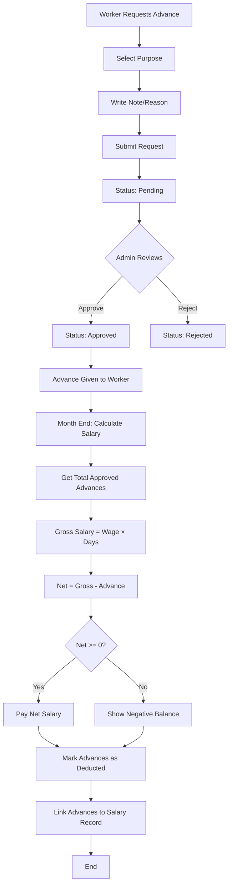

# Advance-Salary Integration & Financial Tracking

## 📋 Overview

This document details the integration between Advance payments and Salary calculations, including automatic deduction and purpose tracking.

---

## 🎯 Key Features

### 1. **Advance Purpose/Note Tracking**
- Every advance must have a purpose/reason
- Track why the advance was taken
- Show history with full details

### 2. **Automatic Salary Deduction**
- Advances automatically deducted from monthly salary
- Show clear breakdown in salary slip
- Handle negative balances (when advance > salary)

### 3. **Financial Transparency**
- Workers see exactly what was deducted
- Admins see complete financial picture
- All transactions tracked and auditable

---

## 🏗️ Database Schema Changes

### **Update Advance Table**

**Add new columns:**
```sql
ALTER TABLE advance ADD COLUMN purpose TEXT;
ALTER TABLE advance ADD COLUMN note TEXT;
ALTER TABLE advance ADD COLUMN status TEXT DEFAULT 'pending';
ALTER TABLE advance ADD COLUMN deductedFromSalaryId INTEGER;
ALTER TABLE advance ADD COLUMN approvedBy INTEGER;
ALTER TABLE advance ADD COLUMN approvedDate TEXT;
```

**Complete Advance Table Schema:**
```sql
CREATE TABLE advance (
  id INTEGER PRIMARY KEY AUTOINCREMENT,
  workerId INTEGER NOT NULL,
  amount REAL NOT NULL,
  date TEXT NOT NULL,
  purpose TEXT NOT NULL,              -- NEW: Medical, Personal, Emergency, etc.
  note TEXT NOT NULL,                 -- NEW: Detailed reason (min 10 chars)
  status TEXT DEFAULT 'pending',      -- NEW: pending, approved, rejected, deducted
  deductedFromSalaryId INTEGER,       -- NEW: Link to salary record
  approvedBy INTEGER,                 -- NEW: Admin who approved
  approvedDate TEXT,                  -- NEW: When approved
  FOREIGN KEY (workerId) REFERENCES users(id),
  FOREIGN KEY (deductedFromSalaryId) REFERENCES salary(id),
  FOREIGN KEY (approvedBy) REFERENCES users(id)
);
```

### **Update Salary Table**

**Add new columns:**
```sql
ALTER TABLE salary ADD COLUMN grossSalary REAL;
ALTER TABLE salary ADD COLUMN advanceDeducted REAL DEFAULT 0;
ALTER TABLE salary ADD COLUMN netSalary REAL;
ALTER TABLE salary ADD COLUMN advanceBalance REAL DEFAULT 0;
```

**Complete Salary Table Schema:**
```sql
CREATE TABLE salary (
  id INTEGER PRIMARY KEY AUTOINCREMENT,
  workerId INTEGER NOT NULL,
  month TEXT NOT NULL,
  totalDays INTEGER NOT NULL,
  grossSalary REAL NOT NULL,          -- NEW: Base salary (wage × days)
  advanceDeducted REAL DEFAULT 0,     -- NEW: Total advance deducted
  netSalary REAL NOT NULL,            -- NEW: Gross - Advance
  advanceBalance REAL DEFAULT 0,      -- NEW: Negative if advance > gross
  totalSalary REAL NOT NULL,          -- Keep for compatibility
  paid INTEGER DEFAULT 0,
  paidDate TEXT,
  FOREIGN KEY (workerId) REFERENCES users(id)
);
```

---

## 📊 Data Models

### **Updated Advance Model**

```dart
class Advance {
  int? id;
  int workerId;
  double amount;
  String date;
  String purpose;           // NEW: Medical, Personal, Emergency, etc.
  String note;              // NEW: Detailed reason
  String status;            // NEW: pending, approved, rejected, deducted
  int? deductedFromSalaryId; // NEW: Link to salary
  int? approvedBy;          // NEW: Admin who approved
  String? approvedDate;     // NEW: Approval date

  Advance({
    this.id,
    required this.workerId,
    required this.amount,
    required this.date,
    required this.purpose,
    required this.note,
    this.status = 'pending',
    this.deductedFromSalaryId,
    this.approvedBy,
    this.approvedDate,
  });

  Map<String, dynamic> toMap() {
    return {
      'id': id,
      'workerId': workerId,
      'amount': amount,
      'date': date,
      'purpose': purpose,
      'note': note,
      'status': status,
      'deductedFromSalaryId': deductedFromSalaryId,
      'approvedBy': approvedBy,
      'approvedDate': approvedDate,
    };
  }

  factory Advance.fromMap(Map<String, dynamic> map) {
    return Advance(
      id: map['id'],
      workerId: map['workerId'],
      amount: map['amount'],
      date: map['date'],
      purpose: map['purpose'],
      note: map['note'],
      status: map['status'] ?? 'pending',
      deductedFromSalaryId: map['deductedFromSalaryId'],
      approvedBy: map['approvedBy'],
      approvedDate: map['approvedDate'],
    );
  }
}
```

### **Updated Salary Model**

```dart
class Salary {
  int? id;
  int workerId;
  String month;
  int totalDays;
  double grossSalary;        // NEW: Base salary (wage × days)
  double advanceDeducted;    // NEW: Total advance taken
  double netSalary;          // NEW: Final amount (gross - advance)
  double advanceBalance;     // NEW: Negative if advance > gross
  double totalSalary;        // Keep for compatibility
  bool paid;
  String? paidDate;

  Salary({
    this.id,
    required this.workerId,
    required this.month,
    required this.totalDays,
    required this.grossSalary,
    this.advanceDeducted = 0,
    required this.netSalary,
    this.advanceBalance = 0,
    required this.totalSalary,
    this.paid = false,
    this.paidDate,
  });

  Map<String, dynamic> toMap() {
    return {
      'id': id,
      'workerId': workerId,
      'month': month,
      'totalDays': totalDays,
      'grossSalary': grossSalary,
      'advanceDeducted': advanceDeducted,
      'netSalary': netSalary,
      'advanceBalance': advanceBalance,
      'totalSalary': totalSalary,
      'paid': paid ? 1 : 0,
      'paidDate': paidDate,
    };
  }

  factory Salary.fromMap(Map<String, dynamic> map) {
    return Salary(
      id: map['id'],
      workerId: map['workerId'],
      month: map['month'],
      totalDays: map['totalDays'],
      grossSalary: map['grossSalary'],
      advanceDeducted: map['advanceDeducted'] ?? 0,
      netSalary: map['netSalary'],
      advanceBalance: map['advanceBalance'] ?? 0,
      totalSalary: map['totalSalary'],
      paid: map['paid'] == 1,
      paidDate: map['paidDate'],
    );
  }
}
```

---

## 💰 Salary Calculation Logic

### **Calculate Monthly Salary with Advance Deduction**

```dart
class SalaryCalculator {
  /// Calculate salary for a worker for a specific month
  static Future<Salary> calculateMonthlySalary({
    required int workerId,
    required String month, // Format: 'yyyy-MM'
    required double dailyWage,
    required int workingDays,
  }) async {
    // Step 1: Calculate gross salary
    double grossSalary = dailyWage * workingDays;
    
    // Step 2: Get all approved advances for this month
    List<Advance> monthlyAdvances = await DatabaseHelper()
        .getAdvancesByWorkerAndMonth(workerId, month);
    
    double totalAdvance = 0;
    for (var advance in monthlyAdvances) {
      if (advance.status == 'approved') {
        totalAdvance += advance.amount;
      }
    }
    
    // Step 3: Calculate net salary
    double netSalary = grossSalary - totalAdvance;
    double advanceBalance = 0;
    
    // Step 4: Handle negative balance
    if (netSalary < 0) {
      advanceBalance = netSalary.abs(); // Carry forward to next month
      netSalary = 0;
    }
    
    // Step 5: Create salary record
    return Salary(
      workerId: workerId,
      month: month,
      totalDays: workingDays,
      grossSalary: grossSalary,
      advanceDeducted: totalAdvance,
      netSalary: netSalary,
      advanceBalance: advanceBalance,
      totalSalary: grossSalary, // Keep for compatibility
      paid: false,
    );
  }
  
  /// Mark advances as deducted when salary is processed
  static Future<void> markAdvancesAsDeducted({
    required int salaryId,
    required List<Advance> advances,
  }) async {
    for (var advance in advances) {
      advance.status = 'deducted';
      advance.deductedFromSalaryId = salaryId;
      await DatabaseHelper().updateAdvance(advance);
    }
  }
}
```

---

## 🎨 UI Components

### **Advance Request Form (Worker)**

```dart
class AdvanceRequestScreen extends StatefulWidget {
  @override
  State<AdvanceRequestScreen> createState() => _AdvanceRequestScreenState();
}

class _AdvanceRequestScreenState extends State<AdvanceRequestScreen> {
  final _formKey = GlobalKey<FormState>();
  final _amountController = TextEditingController();
  final _noteController = TextEditingController();
  String _selectedPurpose = 'Personal';
  
  final List<String> _purposes = [
    'Medical',
    'Personal',
    'Emergency',
    'Education',
    'Family',
    'Travel',
    'Other',
  ];
  
  Future<void> _submitRequest() async {
    if (_formKey.currentState!.validate()) {
      final advance = Advance(
        workerId: currentUser.id!,
        amount: double.parse(_amountController.text),
        date: DateTime.now().toString(),
        purpose: _selectedPurpose,
        note: _noteController.text.trim(),
        status: 'pending',
      );
      
      final success = await advanceProvider.addAdvance(advance);
      
      if (success) {
        Fluttertoast.showToast(
          msg: 'Advance request submitted successfully!',
          backgroundColor: Colors.green,
        );
        Navigator.pop(context);
      }
    }
  }
  
  @override
  Widget build(BuildContext context) {
    return Scaffold(
      appBar: AppBar(title: Text('Request Advance')),
      body: Form(
        key: _formKey,
        child: ListView(
          padding: EdgeInsets.all(20),
          children: [
            // Amount field
            TextFormField(
              controller: _amountController,
              decoration: InputDecoration(
                labelText: 'Amount *',
                prefixIcon: Icon(Icons.currency_rupee),
              ),
              keyboardType: TextInputType.number,
              validator: (value) {
                if (value?.isEmpty ?? true) return 'Enter amount';
                if (double.tryParse(value!) == null) return 'Invalid amount';
                return null;
              },
            ),
            SizedBox(height: 20),
            
            // Purpose dropdown
            DropdownButtonFormField<String>(
              value: _selectedPurpose,
              decoration: InputDecoration(
                labelText: 'Purpose *',
                prefixIcon: Icon(Icons.category),
              ),
              items: _purposes.map((purpose) {
                return DropdownMenuItem(
                  value: purpose,
                  child: Text(purpose),
                );
              }).toList(),
              onChanged: (value) {
                setState(() {
                  _selectedPurpose = value!;
                });
              },
            ),
            SizedBox(height: 20),
            
            // Note/Reason field
            TextFormField(
              controller: _noteController,
              decoration: InputDecoration(
                labelText: 'Note/Reason *',
                hintText: 'Explain why you need this advance...',
                prefixIcon: Icon(Icons.note),
                alignLabelWithHint: true,
              ),
              maxLines: 4,
              validator: (value) {
                if (value?.isEmpty ?? true) {
                  return 'Please provide a reason';
                }
                if (value!.length < 10) {
                  return 'Reason must be at least 10 characters';
                }
                return null;
              },
            ),
            SizedBox(height: 30),
            
            // Submit button
            ElevatedButton(
              onPressed: _submitRequest,
              child: Text('Submit Request'),
              style: ElevatedButton.styleFrom(
                padding: EdgeInsets.symmetric(vertical: 15),
              ),
            ),
          ],
        ),
      ),
    );
  }
}
```

### **Salary Slip with Advance Breakdown**

```dart
class SalarySlipWidget extends StatelessWidget {
  final Salary salary;
  final User worker;
  
  @override
  Widget build(BuildContext context) {
    return Card(
      margin: EdgeInsets.all(20),
      child: Padding(
        padding: EdgeInsets.all(20),
        child: Column(
          crossAxisAlignment: CrossAxisAlignment.start,
          children: [
            Text(
              'Salary Slip - ${salary.month}',
              style: TextStyle(fontSize: 20, fontWeight: FontWeight.bold),
            ),
            Divider(height: 30),
            
            // Gross Salary
            _buildRow(
              'Gross Salary',
              '₹${salary.grossSalary.toStringAsFixed(2)}',
              subtitle: '${worker.wage}/day × ${salary.totalDays} days',
            ),
            
            // Advance Deducted
            if (salary.advanceDeducted > 0)
              _buildRow(
                'Advance Deducted',
                '- ₹${salary.advanceDeducted.toStringAsFixed(2)}',
                subtitle: 'Advance taken this month',
                color: Colors.red,
              ),
            
            Divider(height: 20),
            
            // Net Salary
            _buildRow(
              'Net Salary',
              '₹${salary.netSalary.toStringAsFixed(2)}',
              style: TextStyle(
                fontSize: 18,
                fontWeight: FontWeight.bold,
                color: salary.netSalary >= 0 ? Colors.green : Colors.red,
              ),
            ),
            
            // Advance Balance (if negative)
            if (salary.advanceBalance > 0)
              Container(
                margin: EdgeInsets.only(top: 10),
                padding: EdgeInsets.all(10),
                decoration: BoxDecoration(
                  color: Colors.orange.shade50,
                  borderRadius: BorderRadius.circular(8),
                  border: Border.all(color: Colors.orange),
                ),
                child: Row(
                  children: [
                    Icon(Icons.warning, color: Colors.orange),
                    SizedBox(width: 10),
                    Expanded(
                      child: Text(
                        'Advance balance: ₹${salary.advanceBalance.toStringAsFixed(2)} will be carried to next month',
                        style: TextStyle(fontSize: 12),
                      ),
                    ),
                  ],
                ),
              ),
            
            SizedBox(height: 20),
            
            // View Advance Details button
            if (salary.advanceDeducted > 0)
              TextButton.icon(
                onPressed: () => _showAdvanceBreakdown(context),
                icon: Icon(Icons.receipt),
                label: Text('View Advance Breakdown'),
              ),
          ],
        ),
      ),
    );
  }
  
  Widget _buildRow(
    String label,
    String value, {
    String? subtitle,
    TextStyle? style,
    Color? color,
  }) {
    return Padding(
      padding: EdgeInsets.symmetric(vertical: 8),
      child: Row(
        mainAxisAlignment: MainAxisAlignment.spaceBetween,
        children: [
          Column(
            crossAxisAlignment: CrossAxisAlignment.start,
            children: [
              Text(label, style: TextStyle(fontSize: 14)),
              if (subtitle != null)
                Text(
                  subtitle,
                  style: TextStyle(fontSize: 11, color: Colors.grey),
                ),
            ],
          ),
          Text(
            value,
            style: style ?? TextStyle(
              fontSize: 16,
              fontWeight: FontWeight.w600,
              color: color,
            ),
          ),
        ],
      ),
    );
  }
  
  void _showAdvanceBreakdown(BuildContext context) {
    // Show dialog with advance details
    showDialog(
      context: context,
      builder: (context) => AdvanceBreakdownDialog(
        workerId: worker.id!,
        month: salary.month,
      ),
    );
  }
}
```

### **Advance History with Purpose**

```dart
class AdvanceHistoryList extends StatelessWidget {
  final List<Advance> advances;
  
  @override
  Widget build(BuildContext context) {
    return ListView.builder(
      itemCount: advances.length,
      itemBuilder: (context, index) {
        final advance = advances[index];
        return Card(
          margin: EdgeInsets.symmetric(horizontal: 16, vertical: 8),
          child: ListTile(
            leading: CircleAvatar(
              backgroundColor: _getStatusColor(advance.status),
              child: Icon(
                _getStatusIcon(advance.status),
                color: Colors.white,
              ),
            ),
            title: Row(
              mainAxisAlignment: MainAxisAlignment.spaceBetween,
              children: [
                Text('₹${advance.amount.toStringAsFixed(2)}'),
                _buildStatusChip(advance.status),
              ],
            ),
            subtitle: Column(
              crossAxisAlignment: CrossAxisAlignment.start,
              children: [
                SizedBox(height: 4),
                Row(
                  children: [
                    Icon(Icons.category, size: 14, color: Colors.grey),
                    SizedBox(width: 4),
                    Text(
                      advance.purpose,
                      style: TextStyle(
                        fontWeight: FontWeight.w600,
                        color: Colors.blue,
                      ),
                    ),
                  ],
                ),
                SizedBox(height: 4),
                Text(
                  advance.note,
                  maxLines: 2,
                  overflow: TextOverflow.ellipsis,
                  style: TextStyle(fontSize: 12),
                ),
                SizedBox(height: 4),
                Text(
                  DateFormat('dd MMM yyyy').format(
                    DateTime.parse(advance.date),
                  ),
                  style: TextStyle(fontSize: 11, color: Colors.grey),
                ),
              ],
            ),
            trailing: Icon(Icons.chevron_right),
            onTap: () => _showAdvanceDetails(context, advance),
          ),
        );
      },
    );
  }
  
  Color _getStatusColor(String status) {
    switch (status) {
      case 'pending': return Colors.orange;
      case 'approved': return Colors.green;
      case 'rejected': return Colors.red;
      case 'deducted': return Colors.blue;
      default: return Colors.grey;
    }
  }
  
  IconData _getStatusIcon(String status) {
    switch (status) {
      case 'pending': return Icons.pending;
      case 'approved': return Icons.check_circle;
      case 'rejected': return Icons.cancel;
      case 'deducted': return Icons.payment;
      default: return Icons.info;
    }
  }
  
  Widget _buildStatusChip(String status) {
    return Container(
      padding: EdgeInsets.symmetric(horizontal: 8, vertical: 4),
      decoration: BoxDecoration(
        color: _getStatusColor(status).withOpacity(0.2),
        borderRadius: BorderRadius.circular(12),
      ),
      child: Text(
        status.toUpperCase(),
        style: TextStyle(
          fontSize: 10,
          fontWeight: FontWeight.bold,
          color: _getStatusColor(status),
        ),
      ),
    );
  }
}
```

---

## 🔄 Business Logic Flow

### **Complete Advance-to-Salary Flow**



---

## ✅ Validation Rules

### **Advance Request Validation:**
1. Amount must be > 0
2. Amount should not exceed monthly salary (warning)
3. Purpose must be selected
4. Note must be at least 10 characters
5. Worker cannot have more than 3 pending requests

### **Salary Calculation Validation:**
1. Only approved advances are deducted
2. Advances from current month only
3. Negative balance must be tracked
4. All calculations must be auditable

---

## 📈 Reports & Analytics

### **Admin Dashboard Cards:**
- Total Pending Advance Requests
- Total Approved Advances (This Month)
- Total Advance Amount Given
- Workers with Negative Balance

### **Reports to Add:**
1. **Advance Report**
   - By Purpose/Category
   - By Worker
   - By Status
   - With Notes visible

2. **Salary Report with Advance**
   - Gross Salary
   - Advance Deducted
   - Net Salary
   - Balance Carried Forward

3. **Financial Summary**
   - Total Salary Paid
   - Total Advance Given
   - Net Outflow
   - Outstanding Advance

---

## 🎯 Success Criteria

✅ Workers can request advance with purpose and note  
✅ Admin can see full advance details including purpose  
✅ Salary automatically deducts approved advances  
✅ Negative balance is clearly shown and tracked  
✅ Complete audit trail of all transactions  
✅ Workers understand what was deducted and why  
✅ Advance history shows purpose and notes  
✅ Export includes all financial details  

---

**Implementation Priority: HIGH**  
**Estimated Time: 3-4 days**  
**Dependencies: Basic salary and advance features**

